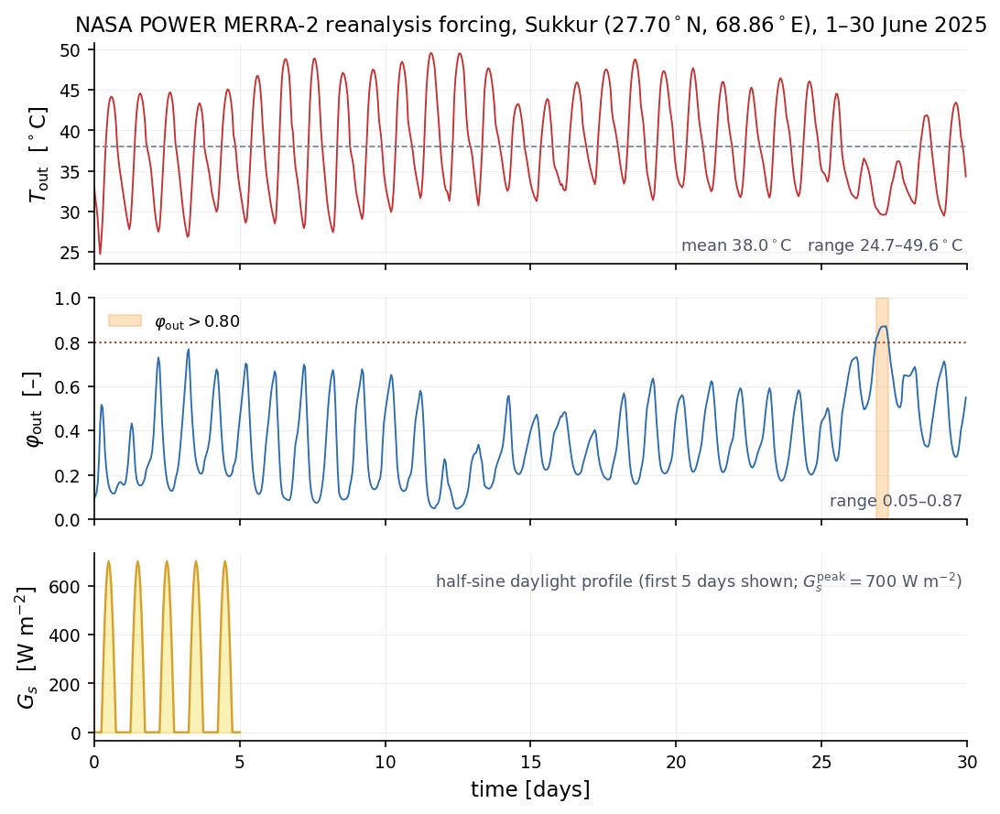
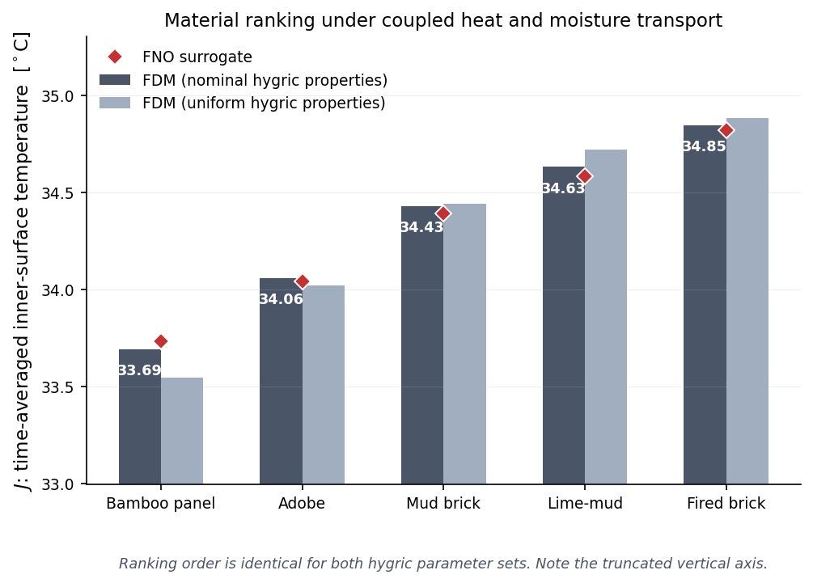
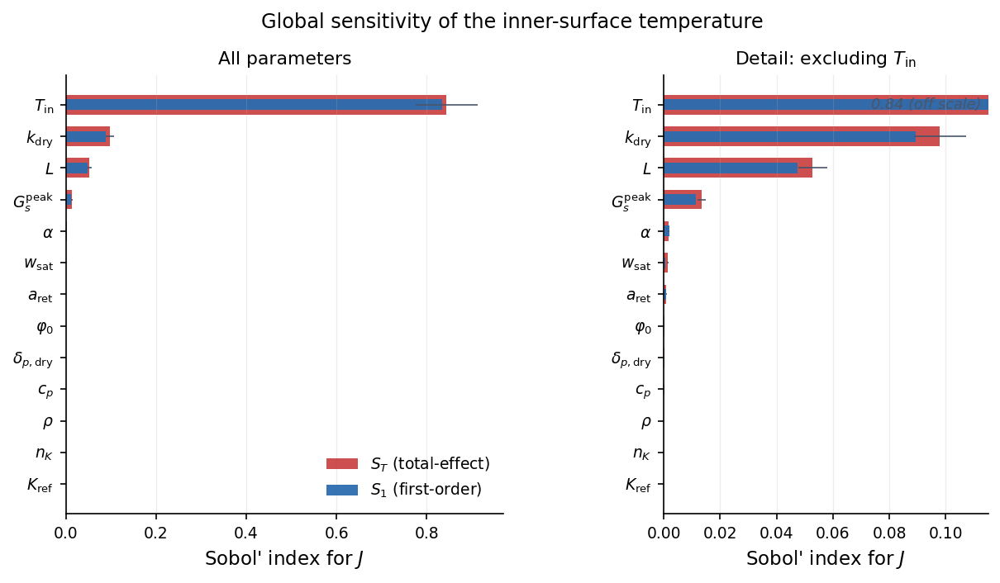
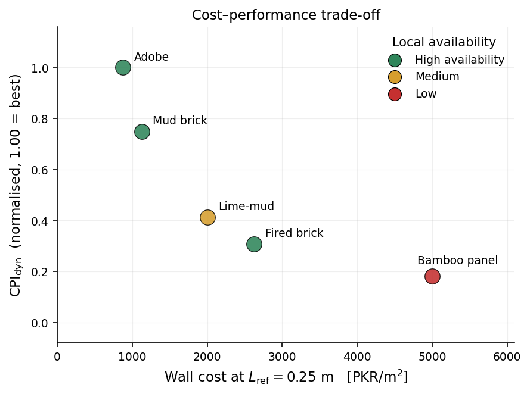

# A Fourier Neural Operator Surrogate for Hygrothermal Ranking of Indigenous Wall Materials in Hot-Dry Climates

[](https://python.org)
[](https://pytorch.org)
[](LICENSE)
[](LICENSE)
[](https://neduet.edu.pk)
[](https://doi.org/10.5281/zenodo.22209804)

> **Sindh Research Project SRSP-321** — NED University of Engineering & Technology, Karachi, Pakistan
> A two-stage FDM + Fourier Neural Operator framework that ranks five indigenous Sindh wall
> materials under coupled heat and moisture transport, quantifies **how much of the resulting
> ranking the input data actually support**, and benchmarks the operator against three direct
> scalar surrogates (quadratic ridge, MLP, Gaussian process) to establish precisely where a full
> field operator adds value over a scalar baseline.

---

## Overview

Thermal comparisons of candidate wall materials are commonly reported as a strict ordering,
often separated by less than a kelvin. This repository implements a framework that produces such
an ordering **and then tests whether it is supported** by the uncertainty in the material
properties that produced it.

Stage 1 solves the 1D Künzel heat-and-moisture (HAM) system in **mixed form** — the moisture
content `w` is conserved, while the liquid flux is written against the capillary-pressure
gradient as in EN 15026:

$$(\rho_s c_s + w\,c_w)\,\frac{\partial T}{\partial t}
  = \frac{\partial}{\partial x}\!\left(k_{\mathrm{eff}}(w)\,\frac{\partial T}{\partial x}\right)
  - L_v\,\frac{\partial g_v}{\partial x}$$

$$\frac{\partial w}{\partial t}
  = \frac{\partial}{\partial x}\!\left(D_w(w)\,\frac{\partial w}{\partial x}
    + \delta_p(w)\,\frac{\partial p_v}{\partial x}\right),
  \qquad g_v = -\delta_p(w)\,\frac{\partial p_v}{\partial x}$$

with a nonlinear retention curve $w(p_{\mathrm{suc}})$, liquid conductivity
$g_l = -K(w)\,\nabla p_{\mathrm{suc}}$, and moisture-dependent vapour permeability
$\delta_p(w)$. **Only the vapour flux carries latent heat** — liquid capillary redistribution
involves no phase change.

`T` and `w` are advanced **monolithically** in one banded Crank–Nicolson solve. This is not a
convenience: written as a divergence, the latent term contains a diffusion contribution in `T`
with effective conductivity $L_v \delta_p \varphi\,\mathrm{d}p_{v,\mathrm{sat}}/\mathrm{d}T$
reaching ~0.17 W m⁻¹ K⁻¹ over the sweep box. Treated explicitly it caps `dt` at ~60 s and
diverges at the 300 s production step.

Outdoor forcing is prescribed from **NASA POWER MERRA-2 reanalysis** at the Sukkur grid point
(27.70 °N, 68.86 °E) for 1–30 June 2025. The dataset spans 2000 LHS samples over a
**13-dimensional** parameter space. Stage 2 trains a **Fourier Neural Operator** (data loss only)
to learn $\boldsymbol{\mu} \mapsto (T(x,t), w(x,t))$, used as a fast surrogate for the sensitivity
and uncertainty analyses.

### Key findings

- **The solver conserves mass and energy to round-off**, and the cumulative latent enthalpy equals
  $L_v$ times the moisture mass imported through the outer surface — an algebraic identity of the
  monolithic assembly, not an approximation. MMS convergence order 2.00.
- **Verified against two externally defined benchmarks** with reference solutions known
  independently of any solver: **EN 15026 (Annex A)** to 0.68 % of the imposed step against a
  Boltzmann similarity solution (tolerance 2.5 %), and **HAMSTAD Benchmark 2** to
  0.0012 kg m⁻³ against the exact Fourier series.
- **Coupled moisture transport is not required for this ranking.** Dynamic redistribution shifts
  the time-averaged inner-surface temperature by **0.4 mK** — below the discretisation error
  itself — and the diurnal peak by 49.4 mK. Every hygric parameter has a total-effect Sobol'
  index statistically indistinguishable from zero. Extending the window to 60 and 90 days raises
  the shift only to 0.94 and 1.41 mK; extrapolated to full moisture equilibrium it reaches
  ~2.1 mK, still two orders of magnitude below the property-uncertainty spread (252–455 mK).
- **Only four of ten pairwise material comparisons resolve at P > 0.95.** What the data support is
  a partial order, not a ranking: the bamboo panel separates from the three denser earthen
  materials, and adobe from fired clay brick; every other comparison — including the two best
  materials against each other — is undetermined.
- **The recommendation survives anyway.** Clay–straw adobe is statistically indistinguishable from
  the best-performing material (P = 0.78) while costing 5.7× less, and holds the best
  cost–performance index in **93 %** of replicates under joint property and price perturbation.
- **Measurement priority is quantified.** Dry thermal conductivity carries **91 %** of the variance
  of `J`. Measuring it to ±5 % raises the closest pair's ordering probability from 0.63 to 0.82;
  adding α(w) and the sorption curve reaches 0.93. Cup tests for δ_p and liquid conductivity K(w)
  — the most demanding measurements of the set — yield **no further improvement**.

---

## Visual Results

<table>
<tr>
<td align="center" valign="top" width="50%">

<br>
<em>NASA POWER MERRA-2 forcing: hourly outdoor air temperature and relative humidity at the Sukkur
grid point, 1–30 June 2025, with the half-sine daylight irradiance profile.</em>
</td>
<td align="center" valign="top" width="50%">

<br>
<em>Five-material ranking by time-averaged inner-surface temperature, FDM ground truth against
neural-operator prediction.</em>
</td>
</tr>
<tr>
<td align="center" valign="top" width="50%">

<br>
<em>First-order and total-effect Sobol' indices for J(μ) over the 13-dimensional parameter space.
Every hygric parameter is indistinguishable from zero.</em>
</td>
<td align="center" valign="top" width="50%">

<br>
<em>Cost–performance trade-off at L<sub>ref</sub> = 0.25 m, coloured by local availability.
Clay–straw adobe occupies the high-CPI, high-availability corner.</em>
</td>
</tr>
</table>

---

## Material Assessment

Nominal conditions: June 2025 NASA POWER Sukkur forcing, T<sub>in</sub> = 32 °C,
G<sub>s,peak</sub> = 700 W m⁻², φ₀ = 0.30, L = 0.25 m, 30-day window.

| # | Material | J<sub>FDM</sub> (°C) | J<sub>peak</sub> (°C) | J<sub>FNO</sub> (°C) | Δw (kg m⁻²) | Availability |
|---|----------|------------|-------------|------------|--------------|--------------|
| 1 | Lime-stabilised bamboo panel | 33.692 | 34.556 | 33.732 | +0.29 | **L** |
| 2 | Clay–straw adobe | 34.056 | 35.395 | 34.040 | +0.19 | **H** |
| 3 | Mud brick (unfired) | 34.429 | 36.191 | 34.390 | +0.14 | **H** |
| 4 | Lime–mud composite | 34.631 | 36.775 | 34.584 | +0.11 | **M** |
| 5 | Fired clay brick | 34.846 | 37.083 | 34.820 | +0.04 | **H** |

> **This ordering is not fully resolved.** Propagating correlated material-property uncertainty
> (64 FDM replicates per material, Gaussian copula) supports only these four relations at
> P > 0.95:
>
> bamboo ≺ {mud brick, lime–mud, fired brick} (P = 0.97, 0.97, 0.98) and adobe ≺ fired brick (P = 0.95)
>
> Bamboo and adobe are not separated (P = 0.78); the three denser materials are mutually
> unresolved (P = 0.62–0.77). Relaxing the threshold to P > 0.85 admits only two further
> comparisons.

**Recommendation:** clay–straw adobe — statistically tied with the thermally best material while
costing 5.7× less per unit wall area, with High local availability. The recommendation does not
depend on the ordering it was derived from being exact.

### Surrogate accuracy (held-out test set, N = 200)

| Metric | Value |
|--------|-------|
| Relative L² on T | 8.65 × 10⁻⁴ |
| Relative L² on w | 8.08 × 10⁻³ |
| MAE on J | 0.031 K |
| MAE on J over the five candidate materials | 0.034 K |
| Speed-up vs direct FDM (T4 GPU) | 287× single sample, 350× batched |
| **Scalar baseline — Gaussian process (ARD Matérn) MAE on J** | **0.0061 K (3.0 % of inter-material gap)** |
| Scalar baseline — MLP 3×256 MAE on J | 0.028 K (13.9 % of gap) |
| Scalar baseline — Quadratic ridge MAE on J | 0.056 K (27.7 % of gap) |
| GP vs FNO Sobol' index agreement (max \|diff\| across 13 params) | 0.001 |
| GP pairwise verdict agreement with FDM | 10/10 pairs |

### Dynamic cost–performance index

CPI<sub>dyn</sub> is referenced to the time-averaged **sol-air temperature**
(T̄<sub>sa</sub> = 44.198 °C), a property of the climate forcing alone — not to the worst
candidate, which would assign it zero benefit by construction.

| Material | J<sub>i</sub> (°C) | Cost (PKR m⁻²) | CPI<sub>dyn</sub> | P(rank) | Availability |
|----------|------------|---------------|-------------------|---------|--------------|
| Clay–straw adobe | 34.056 | 875 | **1.000** | 0.93 | **H** |
| Mud brick (unfired) | 34.429 | 1,125 | 0.749 | 0.93 | **H** |
| Lime–mud composite | 34.631 | 2,000 | 0.413 | 0.93 | **M** |
| Fired clay brick | 34.846 | 2,625 | 0.307 | 0.93 | **H** |
| Lime-stabilised bamboo panel | 33.692 | 5,000 | 0.181 | 1.00 | **L** |

---

## Two-Stage Pipeline

| Stage | Notebook | What it does | Runtime |
|-------|----------|--------------|---------|
| 1 — FDM | `notebooks/fdm_solver_ham.ipynb` | Five-stage verification, EN 15026 and HAMSTAD BM2 benchmarks, 2000-sample LHS sweep, material ranking, correlated uncertainty propagation, measurement prioritisation | ~4 h (CPU) |
| 2 — FNO | `notebooks/fno_ham.ipynb` | Training, accuracy evaluation, ranking verification, Sobol' analysis (15,360 evaluations), data-efficiency study, cost–performance assessment, figures | ~2.5 h (T4 GPU) |

**Run order.** Stage 1 top to bottom — every verification is gated by an `assert` and any failure
stops execution before the sweep. Stage 2 expects `sindh_ham_dataset.npz`,
`sukkur_june2025_climate.npz` and `ham_uncertainty_mc.csv` from Stage 1; run sections
1–4, 6, 7, 8, 10, 13, 14 in that order (Section 14 is the scalar surrogate baseline comparison; if running Section 11 for CPI figures, run Section 8 first as it provides `MATERIALS`).

### FDM solver (Stage 1)

Monolithic Crank–Nicolson on interleaved unknowns `u = [T₀, w₀, T₁, w₁, …]`, banded with
half-bandwidth 3, nonlinear coefficients lagged at `tⁿ`. Production grid: N = 64 intervals,
Δt = 300 s, 8,640 steps over 30 days. Because the same discrete vapour flux enters the moisture
balance and the latent part of the energy balance, and the same linearised surface flux closes
both boundary conditions, interior face contributions telescope in both balances.

Conservation residuals are normalised by the **cumulative absolute boundary exchange**, not by
the net mass change — roughly 6 % of the sweep box wets and dries back to within 2 % of its
starting moisture, and a net-change denominator turns a round-off residual into a spurious error.

### Neural operator (Stage 2)

```
Input: (ξ, τ, μ₁…μ₁₃) ∈ ℝ¹⁵ broadcast on the 65×361 (x,t) strided grid
  └─► 4 × [SpectralConv2d(width 32, modes 16×64) + pointwise Conv + GELU]
        └─► Projection head (2 output channels)
Output: (T̂(x,t), ŵ(x,t)) on the full 65×721 hourly grid
```

| Hyperparameter | Value |
|----------------|-------|
| Input channels | 15 (2 grid coordinates + 13 parameters) |
| Parameters | 8,395,842 |
| Loss | Relative L² on both fields (data only — **not** physics-informed) |
| Optimiser | Adam, lr 10⁻³, step decay ×0.5 every 50 epochs |
| Train / val / test | 1600 / 200 / 200 |
| Normalisation | z-score; `delta_p_dry` and `K_ref` in log₁₀ space (decade-spanning) |

---

## Repository Structure
> **Note:** `data/sindh_ham_dataset.npz` (558 MB) and the trained operator
> weights (64 MB) exceed GitHub's file-size limits and are archived in the
> Zenodo record linked above.

```
fno-wall-ham/
├── notebooks/
│   ├── fdm_solver_ham.ipynb          # Stage 1: verification, benchmarks, sweep, UQ
│   └── fno_ham.ipynb                 # Stage 2: training, Sobol', CPI, figures
├── data/
│   ├── sindh_ham_dataset.npz         # 2000-sample LHS dataset (30-day coupled HAM)
│   ├── sukkur_june2025_climate.npz   # NASA POWER MERRA-2 forcing, 1–30 June 2025
│   └── ham_uncertainty_mc.npz        # 500 correlated property draws per material
├── models/
│   └── fno_model_ham.pt              # trained operator weights
├── results/
│   ├── fdm_convergence_ham.csv       # space–time convergence study
│   ├── en15026_benchmark.csv         # EN 15026 deviations vs Boltzmann reference
│   ├── hamstad_bm2.csv               # HAMSTAD BM2 deviations vs analytical solution
│   ├── material_ranking_fdm.csv      # FDM ground truth, nominal + uniform hygric
│   ├── ham_uncertainty_mc.csv        # per-material J distributions, rank probabilities
│   ├── measurement_priority.csv      # ∂J/∂ln p and measurement-scenario probabilities
│   ├── window_sensitivity.csv        # coupling shift vs simulation window length
│   ├── sobol_results_ham.csv         # Sobol' indices with 95 % bootstrap CIs
│   ├── data_efficiency_ham.csv       # accuracy vs training-set size
│   ├── cpi_results_ham.csv           # dynamic cost–performance index
│   ├── baseline_accuracy_ham.csv     # scalar surrogate test-set accuracy vs FNO
│   ├── baseline_data_efficiency_ham.csv  # data efficiency: GP / MLP / ridge vs FNO
│   ├── baseline_uq_ham.csv           # GP vs FNO decision fidelity on MC sets
│   └── baseline_sobol_ham.csv        # GP vs FNO Sobol' index comparison
├── assets/                           # figures (PDF for LaTeX, PNG for this README)
├── requirements.txt
├── README.md
└── LICENSE
```

---

## Key Design Decisions

**Why is the latent term a flux divergence and not `∂w/∂t`?**
Total moisture `w` includes liquid water, and liquid capillary redistribution involves no phase
change, so it carries no latent heat. Only the vapour flux does. Using `−L_v ∂w/∂t` is also sign-
wrong: during evaporation `∂w/∂t < 0` gives a positive source, i.e. heating during drying. The
correct form is Künzel's `−L_v ∇·g_v`, which HAMSTAD, HAM-Tools and HAMFit all use.

**Why is there no latent term in the outer heat boundary condition?**
Integrating `−L_v ∂g_v/∂x` over the wall gives `+L_v g_v|₀` because the inner face is
impermeable — the interior source *already* imports the latent enthalpy accompanying vapour
crossing the exterior surface. Adding `L_v β_p(p_v,out − p_v)` to the boundary condition as well
counts it twice; the discrete energy balance detects this immediately.

**Why solve monolithically rather than by operator splitting?**
The temperature-gradient part of the vapour flux is a diffusion term in `T` with effective
conductivity up to ~0.17 W m⁻¹ K⁻¹. Explicitly it caps `dt` at ~60 s over parts of the sweep box
and diverges at 300 s. Solving both fields together removes the restriction and the O(Δt)
splitting error.

**Why a nonlinear retention curve instead of `w = w_sat·φ`?**
The linear isotherm overstates the hygroscopic moisture capacity by roughly 2× at mid-range
humidity. For nominal adobe it absorbed **12× too much water** over 30 days and shifted `J` by
~0.6 K — more than twice the closest inter-material contrast. This is a physics error, not a
refinement.

**Why is δ_p specified through a vapour resistance factor µ?**
`δ_p = δ_air / µ` with `δ_air = 1.93 × 10⁻¹⁰` kg m⁻¹ s⁻¹ Pa⁻¹. Stating it this way guards against
implausible assignments: a µ below about 3 would make a solid wall nearly as vapour-open as still
air. Fired clay brick uses µ = 22.1 measured by Koči et al. (2018); the others are assigned by
material class (bamboo 4, adobe 6, mud brick 8, lime–mud 10).

**Why report a partial order instead of a ranking?**
Because that is what the data support. σ per material is 0.25–0.46 K while consecutive gaps are
0.20–0.37 K. Inferring a strict five-way ordering would attribute a resolution the input
properties do not carry. Even full laboratory characterisation leaves the closest pair marginal,
since their conductivities differ by only 22 %.

**Why fix the climate forcing across all 2000 samples?**
Holding the NASA POWER series identical ensures differences in `J(μ)` are attributable to material
and geometric properties alone, not sampled weather variability. Robustness across climate
realisations is identified as future work.

---

## References

- Künzel, H. M. (1995). *Simultaneous Heat and Moisture Transport in Building Components.* IRB Verlag, Stuttgart.
- EN 15026:2007. *Hygrothermal performance of building components and building elements — Assessment of moisture transfer by numerical simulation.* CEN, Brussels.
- Hagentoft, C.-E. (2002). *HAMSTAD — WP2 Modelling, Version 4.* Report R-02:9, Chalmers University of Technology.
- Hagentoft, C.-E., et al. (2004). Assessment method of numerical prediction models for combined heat, air and moisture transfer in building components. *Journal of Thermal Envelope and Building Science*, 27(4), 327–352.
- Koči, V., et al. (2018). Heat and moisture transport and storage parameters of bricks affected by the environment. *International Journal of Thermophysics*, 39(63).
- Celia, M. A., Bouloutas, E. T., & Zarba, R. L. (1990). A general mass-conservative numerical solution for the unsaturated flow equation. *Water Resources Research*, 26(7), 1483–1496.
- van Schijndel, A. W. M., Goesten, S., & Schellen, H. L. (2017). Simulating the complete HAMSTAD benchmark using a single model implemented in Comsol. *Energy Procedia*, 132, 429–434.
- Li, Z., et al. (2021). Fourier neural operator for parametric partial differential equations. *ICLR*.
- Saltelli, A., et al. (2010). Variance based sensitivity analysis of model output. *Computer Physics Communications*, 181(2), 259–270.
- NASA Langley Research Center. NASA Prediction of Worldwide Energy Resources (POWER), Hourly Data, MERRA-2. https://power.larc.nasa.gov

---

## Citation

```bibtex
@article{fahim2026ham,
  author  = {Fahim Raees and Muhammad Akbar Khan},
  title   = {A Fourier Neural Operator Surrogate for Hygrothermal Ranking
             of Indigenous Wall Materials in Hot-Dry Climates},
  year    = {2026},
}

@dataset{fahim2026ham_data,
  author    = {Fahim Raees and Muhammad Akbar Khan},
  title     = {A Fourier Neural Operator Surrogate for Hygrothermal Ranking
             of Indigenous Wall Materials in Hot-Dry Climates: Source Code and Data},
  publisher = {Zenodo},
  year      = {2026},
  doi       = {10.5281/zenodo.22209804}
}
```

---

## Author

**Muhammad Akbar Khan**
Research Assistant, Sindh Research Project SRSP-321 · MS Applied Mathematics, NED University of Engineering & Technology
Research interests: Scientific Machine Learning · Neural Operators · Numerical PDEs

akbar.bsma1337@gmail.com · [GitHub](https://github.com/AkbarTheAnalyst) · [ORCID 0009-0001-7956-0080](https://orcid.org/0009-0001-7956-0080) · [Website](https://akbarkhan.dev) · [LinkedIn](https://linkedin.com/in/muhammad-akbar-khan-826129204)

Principal Investigator: Dr. Fahim Raees, Chairperson & Associate Professor, Department of Mathematics, NED University (PhD, TU Delft 2016)

---

## License

Code (notebooks and scripts) is released under the **MIT License**. Data files,
trained model weights, tabulated results, and figures are released under
**CC BY 4.0**. See [LICENSE](LICENSE) for details and for the NASA POWER
attribution requirement.

---

*This work was conducted under Sindh Research Project SRSP-321 at NED University of Engineering & Technology, Karachi, Pakistan.*
